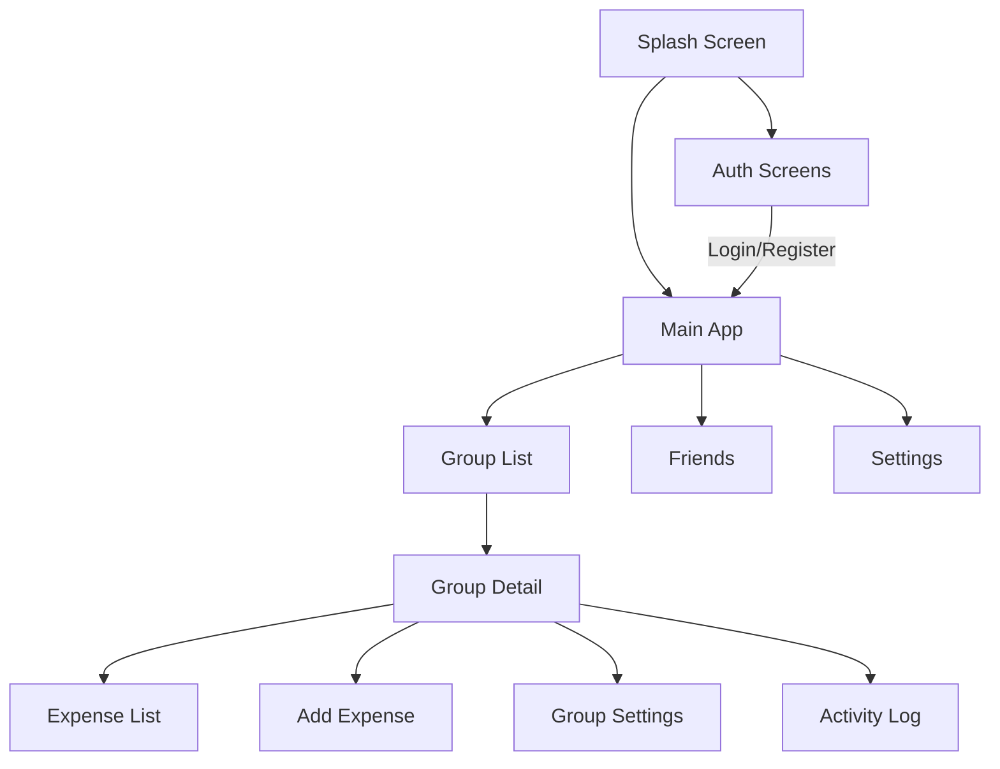

# Fair Share - UI Flow Documentation

## Version
1.0.0 - Initial Documentation

## Document History
- 2025-05-30: Initial version with comprehensive UI flow and component documentation
- 2025-05-30: Added detailed component specifications and UI/UX improvement suggestions

## Table of Contents
1. [App Overview](#app-overview)
2. [Navigation Flow](#navigation-flow)
3. [Screen Details](#screen-details)
4. [User Authentication Flow](#user-authentication-flow)
5. [Group Management Flow](#group-management-flow)
6. [Expense Management Flow](#expense-management-flow)
7. [UI Components](#ui-components)
8. [Theming and Styling](#theming-and-styling)

## App Overview
Fair Share is a group expense splitting application that allows users to track shared expenses with friends and family. The app features a clean, modern Material Design 3 interface with a focus on usability and clear financial tracking.

## Navigation Flow

### Main Navigation Structure

### Authentication Flow
1. **Splash Screen**
   - Brief app logo display
   - Checks authentication state
   - Redirects to Login or Main App

2. **Login Screen**
   - Email/Password login
   - Google Sign-In option
   - Forgot Password link
   - Register navigation

3. **Registration**
   - New user signup form
   - Email verification
   - Profile setup

## Screen Details

### 1. Splash Screen
- **App Logo**: Centered, large app logo with fade-in animation
- **Loading Indicator**: Circular progress indicator below the logo
- **Auto-navigation**: Automatically transitions after 2 seconds or when auth state is determined

#### Components:
- `SplashScreen`
  - **Type**: Full-screen composable
  - **Location**: `ui/screens/splash/SplashScreen.kt`
  - **Purpose**: First screen shown during app launch
  - **Behavior**: Checks authentication state and navigates accordingly

### 2. Authentication Screens

#### Login Screen
- **Email Field**: Text input with email keyboard type and validation
- **Password Field**: Secure text input with show/hide toggle
- **Login Button**: Primary button to submit credentials
- **Google Sign-In Button**: Custom button with Google logo
- **Forgot Password Link**: Secondary text button below login
- **Register Link**: Text button at bottom of screen

**Components**:
- `LoginScreen`
  - **Location**: `ui/screens/auth/LoginScreen.kt`
  - **Text Fields**:
    - Email: `OutlinedTextField` with email validation
    - Password: `OutlinedTextField` with password visibility toggle
  - **Buttons**:
    - Login: `FilledTonalButton` with loading state
    - Google Sign-In: `OutlinedButton` with icon
  - **Links**:
    - Forgot Password: `TextButton` below login button
    - Register: `TextButton` in bottom row

### Registration Screen
- **Name Field**: Text input for full name
- **Email Field**: Validated email input
- **Password Field**: With strength indicator and requirements
- **Confirm Password**: Must match password field
- **Register Button**: Primary action button
- **Login Link**: For existing users

**Components**:
- `RegisterScreen`
  - **Location**: `ui/screens/auth/RegisterScreen.kt`
  - **Form Fields**:
    - Name: `OutlinedTextField` with basic validation
    - Email: `OutlinedTextField` with email validation
    - Password: `OutlinedTextField` with strength meter
    - Confirm Password: `OutlinedTextField` with match validation
  - **Buttons**:
    - Register: `FilledTonalButton` with loading state
    - Back to Login: `TextButton` at bottom

### Email Verification Screen
- **Verification Status**: Icon and message
- **Resend Email Button**: For unverified users
- **Continue Button**: Appears after verification

### Forgot Password Screen
- **Email Input**: For password reset link
- **Send Reset Link Button**: Primary action
- **Back to Login**: Secondary action

## Main Application Screens

### 3. Group List Screen
- **Floating Action Button (FAB)**: `+` icon for creating new groups
- **Search Bar**: At top for filtering groups
- **Group Cards**: Scrollable list of user's groups
- **Pull-to-Refresh**: For manual updates
- **Empty State**: Illustration and CTA when no groups exist

**Components**:
- `GroupListScreen`
  - **Location**: `ui/screens/groups/GroupListScreen.kt`
  - **Top App Bar**:
    - Title: "My Groups"
    - Search: `SearchBar` component
    - Profile/Logout: `IconButton` in top-right
  - **Floating Action Button**:
    - Icon: `Icons.Default.Add`
    - Action: Navigates to Create Group screen
  - **Group Card**:
    - Group name and icon
    - Member count
    - Balance summary
    - Last activity timestamp
    - Clickable area for group details

### Group Detail Screen
- **Group Name & Info**: At the top
- **Balance Summary**: Visual representation
- **Quick Actions**:
  - Add Expense
  - View All Expenses
  - Settle Up
  - Group Settings
- **Recent Activity**: List of recent transactions

**Components**:
- `GroupDetailScreen`
  - **Location**: `ui/screens/groups/GroupDetailScreen.kt`
  - **Top App Bar**:
    - Back button
    - Group name as title
    - Overflow menu for additional actions
  - **Action Buttons**:
    - Add Expense: `ExtendedFloatingActionButton` with icon
    - View Expenses: `OutlinedButton`
    - Settle Up: `Button` with payment icon
    - Settings: `IconButton`

### Add/Edit Expense Screen
- **Amount Input**: With currency formatting
- **Description**: Required field
- **Payer Selection**: Dropdown of group members
- **Date Picker**: For expense date
- **Category Selector**: Icons for common categories
- **Split Options**: Toggle between equal/percentage/custom
- **Participant Toggle**: Checkboxes for each member
- **Receipt Upload**: Optional image attachment
- **Save/Cancel Buttons**: With validation

**Components**:
- `AddExpenseScreen`
  - **Location**: `ui/screens/expenses/AddExpenseScreen.kt`
  - **Form Fields**:
    - Amount: `OutlinedTextField` with `NumberFormat`
    - Description: `OutlinedTextField`
    - Payer: `ExposedDropdownMenuBox`
    - Date: `OutlinedTextField` with `DatePickerDialog`
  - **Category Selection**:
    - Horizontal `Row` of `FilterChip` components
  - **Split Options**:
    - `SegmentedButton` for split type
    - Custom split inputs when applicable
  - **Action Buttons**:
    - Save: `FilledTonalButton` (disabled when invalid)
    - Cancel: `TextButton`

### Expense List Screen
- **Filter Bar**: By category, date range, amount
- **Sort Options**: Date, amount, category
- **Expense Items**: Grouped by date
- **Floating Action Button**: For adding new expenses

**Components**:
- `ExpenseListScreen`
  - **Location**: `ui/screens/expenses/ExpenseListScreen.kt`
  - **Top App Bar**:
    - Back button
    - Title with count
    - Filter/Sort buttons
  - **Expense List**:
    - `LazyColumn` with sticky headers for dates
    - Each item shows amount, description, payer
    - Swipe actions for quick delete/edit

### Expense Detail Screen
- **Header**: Amount and category
- **Details Section**:
  - Payer and date
  - Description
  - Split details
  - Attached receipt (if any)
- **Action Buttons**:
  - Edit
  - Delete
  - Share

**Components**:
- `ExpenseDetailScreen`
  - **Location**: `ui/screens/expenses/ExpenseDetailScreen.kt`
  - **Header**:
    - Category icon and amount
    - Payer avatar and name
  - **Details Section**:
    - `Card` with padding for details
    - `Divider` between sections
  - **Action Buttons**:
    - Edit: `OutlinedButton`
    - Delete: `TextButton` with warning color
    - Share: `IconButton`

### Settlement Screen
- **Balances Overview**: Who owes what
- **Settle Up Button**: For each balance
- **Settlement History**: Past settlements

**Components**:
- `SettlementScreen`
  - **Location**: `ui/screens/settlements/SettlementScreen.kt`
  - **Balance Cards**:
    - Owed/Paid amounts
    - User avatars
  - **Settle Up Button**:
    - `FilledTonalButton` with payment icon
  - **History Section**:
    - Collapsible section
    - List of past settlements

## User Authentication Flow

### Login Process
1. User enters email/password or selects Google Sign-In
2. System validates credentials
3. On success:
   - Navigate to Group List
   - Load user data and groups
4. On failure:
   - Show appropriate error message
   - Allow retry

### Registration Process
1. User enters registration details
2. System validates input
3. Create account in Firebase
4. Send verification email
5. Navigate to email verification screen

## Group Management Flow

### Creating a Group
1. User taps FAB in Group List
2. Enters group details (name, description, currency)
3. Adds members (from contacts or by email)
4. Confirms creation
5. Redirected to new group's detail screen

### Managing Group Members
1. Navigate to Group Settings
2. Select "Manage Members"
3. View current members and their roles
4. Options to:
   - Add new members
   - Remove members
   - Change roles (admin/member)
   - Leave group

## Expense Management Flow

### Adding an Expense
1. From Group Detail, tap "Add Expense"
2. Fill in expense details
3. Select participants
4. Choose split method
5. Add optional details (category, receipt, notes)
6. Save expense

### Settling Up
1. From Group Detail, tap "Settle Up"
2. View who owes what
3. Initiate payment
4. Record settlement
5. Update balances

## UI Components

### Core Components
- **TopAppBar**: Consistent header with title and actions
- **Bottom Navigation**: Main app navigation
- **Floating Action Button (FAB)**: Primary actions
- **Cards**: Group and expense items
- **Dialogs**: Confirmation and input dialogs
- **Snackbars**: Temporary notifications

### Form Elements
- Text fields with validation
- Currency input with formatting
- Date picker
- Dropdown selectors
- Toggle switches
- Radio buttons for options

## Theming and Styling

### Color Scheme
- Primary: Deep Purple (#673AB7)
- Secondary: Teal (#009688)
- Background: Light/Dark theme support
- Error: Red (#F44336)
- Success: Green (#4CAF50)

### Typography
- Headings: Roboto Bold
- Body: Roboto Regular
- Buttons: Roboto Medium
- Small text: Roboto Light

### Spacing
- 4dp grid system
- Consistent padding and margins
- Responsive layouts for different screen sizes

## UI/UX Improvement Suggestions

### 1. Onboarding Experience
- **Add guided tour** for first-time users
- **Interactive tutorial** for key features
- **Permission explanations** for required permissions
- **Demo mode** to explore without creating an account

### 2. Navigation Enhancements
- **Bottom navigation** for main sections
- **Swipe gestures** for common actions
- **Quick actions** from home screen
- **Search functionality** across all screens

### 3. Visual Feedback
- **Loading states** with skeleton UI
- **Success/error toasts** for user actions
- **Haptic feedback** for important interactions
- **Visual cues** for new features

### 4. Performance Optimizations
- **Image optimization** for receipts
- **Lazy loading** for expense lists
- **Caching** of frequent data
- **Background sync** for offline support

### 5. Personalization
- **Custom categories** for expenses
- **Themes and dark mode**
- **Default currency** per group
- **Favorite splits** for quick expense entry

### 6. Accessibility Improvements
- **Dynamic text sizing**
- **High contrast mode**
- **Screen reader support**
- **Reduced motion** option
- **Color-blind friendly** palette

### 7. Error Prevention
- **Undo** for deletions
- **Input validation** with clear messages
- **Confirmation dialogs** for destructive actions
- **Auto-save** for forms

### 8. Social Features
- **Comments** on expenses
- **Reactions** to expenses
- **Group announcements**
- **Activity feed** with filters

### 9. Reporting
- **Export** to PDF/CSV
- **Spending trends**
- **Category-wise analysis**
- **Monthly/Yearly reports**

### 10. Integration
- **Calendar sync**
- **Bank integration**
- **Receipt scanning**
- **Expense reminders**

## Accessibility
- **High contrast support**
- **Scalable text**
- **Content descriptions** for images
- **Touch target size** (48dp minimum)
- **Screen reader support**
- **Keyboard navigation**
- **Reduced motion** option
- **Color contrast** compliance with WCAG 2.1